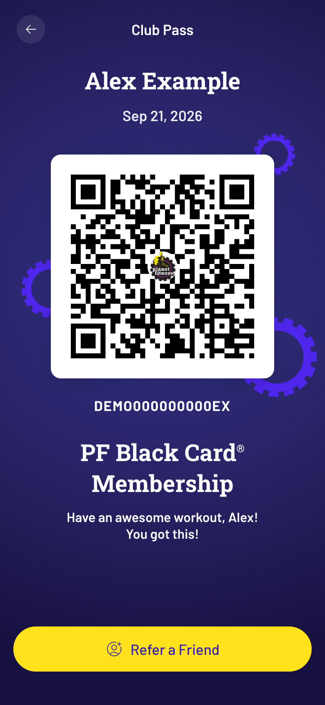

# PF QR Code Generator

A web version of the Planet Fitness club pass, for members who can't install the app.


[](https://www.typescriptlang.org/)
[](https://preactjs.com/)
[](https://vite.dev/)
[](https://learn.microsoft.com/azure/static-web-apps/overview?WT.mc_id=AI-MVP-5004204)



## Why this exists

I have a Planet Fitness membership, but the Planet Fitness app isn't in the UK App Store, so I can't install it on my phone. The front desk checks you in by scanning the QR code on the app's Club Pass screen. This app shows the same pass in a browser, so I can add it to my home screen and scan in like everyone else.

## How it works

The check-in QR code holds your member ID and a UTC timestamp:

```
[memberId]/mobile/MMDDYYYY-HHMMSS
```

The scanners accept a code for about two hours after its timestamp. The page makes a new timestamp every 30 minutes and whenever you come back to it, so the code on screen is always fresh.

**Spa mode.** The spa and HydroMassage scanners won't accept the timestamped code; they want the bare member ID. Tap **Refer a Friend** and the QR switches to just your member ID. The label goes bold and the icon turns into a magnifying glass. Tap it again to go back to the gym code. The toggle hides behind the real app's button, so the pass still looks right at the front desk.

## Get your member ID

You need the official app once, on any device that has it: a friend's phone, an Android phone, or an iPhone signed in to a US App Store account.

1. Sign in to the Planet Fitness app with your account and open **Club Pass**.
2. Take a screenshot of the QR code.
3. Decode it with any QR reader. The text looks like `ABC123XYZ456789/mobile/09212026-181500`.
4. Your member ID is everything before `/mobile/`.

The ID changes every now and then. If your pass stops scanning, decode a fresh screenshot and update the ID.

## Try it locally

You need Node.js 22.18 or later.

```bash
git clone https://github.com/sealjay/pf-qrcode-gen.git
cd pf-qrcode-gen
npm install
cp .env.example .env.local   # then put your member ID and name in it
npm run dev
```

Open <http://localhost:5173>. To try it on your phone over Wi-Fi, run `npm run dev -- --host` and open the network URL it prints.

## Deploy your own

I host mine on [Azure Static Web Apps](https://learn.microsoft.com/azure/static-web-apps/overview?WT.mc_id=AI-MVP-5004204) on the Free plan, behind a GitHub login that only lets me in.

1. Fork this repo.
2. In the Azure portal, create a Static Web App on the Free plan and choose **Other** as the deployment source.
3. Copy its deployment token (**Overview → Manage deployment token**) and add it to your fork as the Actions secret `AZURE_STATIC_WEB_APPS_API_TOKEN`.
4. Add two more Actions secrets: `VITE_MEMBER_ID` and `VITE_MEMBER_NAME`.
5. Run the **Azure Static Web Apps CI/CD** workflow from the Actions tab, or push to `main`.
6. In the Static Web App, open **Role management**, choose **Invite**, pick GitHub, enter your GitHub username and give it the role `owner`. Open the invite link and accept it.
7. Open the site on your phone, sign in with GitHub, then use **Share → Add to Home Screen**.

### Keep it private

Your member ID is baked into the site's JavaScript, and anyone who can load the page can check in as you. `staticwebapp.config.json` only lets GitHub users with the `owner` role in, and search engines are told not to index the page. Don't host it anywhere without a login in front of it.

## Troubleshooting

- **The pass won't scan.** Your member ID has probably changed; see [Get your member ID](#get-your-member-id). Also check your phone's clock, because the timestamp comes from your phone.
- **The spa scanner rejects it.** Tap **Refer a Friend** to switch to spa mode.
- **The page says "Almost there".** The build didn't get `VITE_MEMBER_ID` and `VITE_MEMBER_NAME`. Check `.env.local` locally, or the Actions secrets on your fork, then rebuild.

## Development

```bash
npm run lint   # Biome
npm test       # the QR payload format
npm run build  # tests, type check, then Vite build
```

It's built with Preact, [uqr](https://github.com/unjs/uqr) for the QR matrix, Vite and Biome. The whole app is one component, `src/components/QRCodeGenerator.tsx`; the payload format lives in `src/pass.ts`.

## Disclaimer

This is a personal project. It isn't affiliated with or endorsed by Planet Fitness. Planet Fitness, PF Black Card and the Planet Fitness logo are trademarks of Planet Fitness Franchising, LLC. Only use it with your own active membership. It may stop working if Planet Fitness changes its check-in format.

## Licence

[MIT](./LICENCE)
